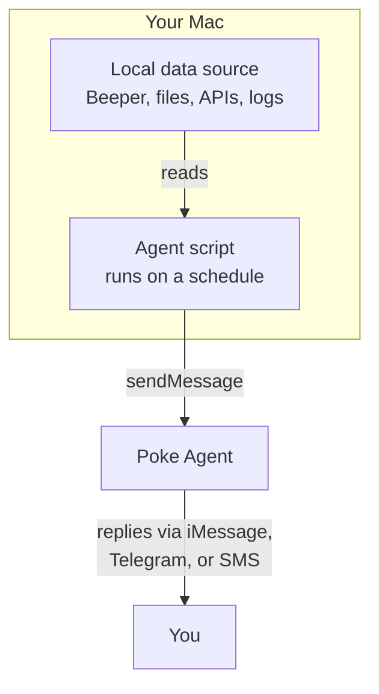

# Agents

Agents are scheduled scripts that **push information from your computer to Poke**. They run in the background, gather data from local sources (APIs, files, services), and send it to your Poke agent — so Poke learns about what's happening on your machine without you asking.

Think of it this way: **Tools** let Poke pull from your machine (you ask, Poke acts). **Agents** let your machine push to Poke (your computer tells Poke, Poke learns and replies).

::: tip Secure and deterministic
Agents are **push-only** — they send data to Poke, but Poke cannot reach back into the agent or your computer through them. Each agent is a plain JavaScript file that you write and control. It runs the same way every time, with no AI decision-making involved. The agent doesn't "try" to access your machine — it only does exactly what the script says. This makes agents predictable, auditable, and safe.
:::



**Example:** A Beeper agent runs every hour, fetches your unread messages, and sends a digest to Poke. Now Poke knows who messaged you — and can answer "did anyone text me?" without needing your machine in real time.

## How agents work

1. You place a `.js` file in `~/.config/poke-around/agents/`
2. The filename defines the schedule: `name.interval.js`
3. When Poke Gate connects, it discovers all agents and starts their timers
4. Each agent runs once immediately, then repeats on schedule
5. Agents use the Poke SDK to send messages — pushing data to your agent

## Naming convention

```
<name>.<interval>.js
```

| File | Runs |
|------|------|
| `beeper.1h.js` | Every hour |
| `backup.2h.js` | Every 2 hours |
| `health.10m.js` | Every 10 minutes |
| `cleanup.30m.js` | Every 30 minutes |
| `digest.24h.js` | Every 24 hours |

**Intervals:** `Nm` (minutes) or `Nh` (hours). Minimum is **10 minutes**.

## Frontmatter

Each agent starts with a JSDoc-style frontmatter block:

```javascript
/**
 * @agent beeper
 * @name Beeper Message Digest
 * @description Fetches messages from the last hour and sends a summary.
 * @interval 1h
 * @env BEEPER_TOKEN - Beeper Desktop local API token
 * @author f
 */
```

The `@name` and `@description` are shown in the macOS app's Agents editor and in the scheduler logs.

## Per-agent env files

Each agent can have a `.env.<name>` file in the same directory:

```
~/.config/poke-around/agents/.env.beeper
```

```env
BEEPER_TOKEN=your_token_here
BEEPER_BASE_URL=http://localhost:23373
```

Variables are injected into the agent's environment automatically. The agent reads them via `process.env.BEEPER_TOKEN`.

## What's next?

- [Creating Agents](/agents/creating) — write your first agent from scratch
- [Installing Agents](/agents/installing) — download community agents
- [Beeper Example](/agents/beeper) — full walkthrough of a real agent
