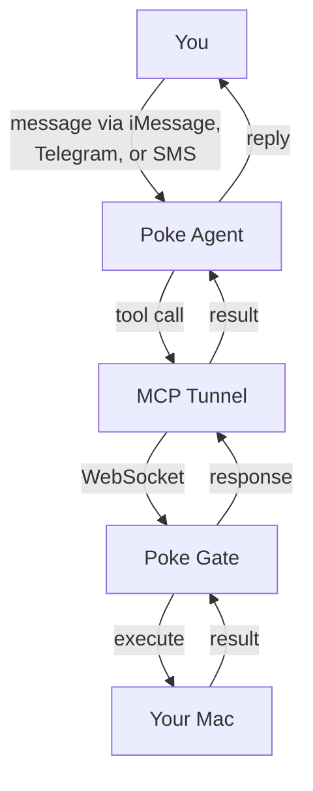

# How It Works

Poke Gate bridges your machine to Poke's cloud so your AI assistant can execute tasks locally.

## Architecture

## Step by step

1. **You send a message** to Poke from iMessage, Telegram, or SMS — e.g. "What's running on port 3000?"

2. **Poke's agent processes it** and decides it needs your machine to answer. It picks a tool like `run_command`.

3. **The tool call travels through the MCP tunnel** — a WebSocket connection from Poke's cloud to your machine via the Piko protocol.

4. **Poke Gate receives the call** on your local MCP server (a lightweight HTTP server running on localhost).

5. **The tool executes locally** — runs the shell command, reads the file, takes the screenshot, etc.

6. **The result flows back** through the tunnel to Poke's agent, which formats it and replies to you.

## Key components

### MCP Server

A local HTTP server implemented in **Zig** that implements the [Model Context Protocol](https://modelcontextprotocol.io) (MCP) using raw JSON-RPC over HTTP. It exposes tools like `run_command`, `read_file`, etc.

### PokeTunnel

A WebSocket-based tunnel from the [Poke SDK](https://www.npmjs.com/package/poke) that connects your local MCP server to Poke's cloud. Uses the Piko protocol with Yamux multiplexing for reliable, multiplexed communication.

### Connection lifecycle

- On startup, Poke Gate creates a connection via `POST /mcp/connections/cli`
- A WebSocket tunnel is established to the upstream URL
- Poke's cloud can now route tool calls through the tunnel to your machine
- If the connection drops, it reconnects automatically
- Old connections are cleaned up before creating new ones to prevent duplicates

## On-connect notification

When the tunnel connects, Poke Gate sends a message to your Poke agent:

> "Hey! I've connected my computer to you via Poke Gate. You can now run commands, read and write files, list directories, take screenshots, and check system info on my machine."

This ensures the agent knows your machine is available and which tools it can use.
